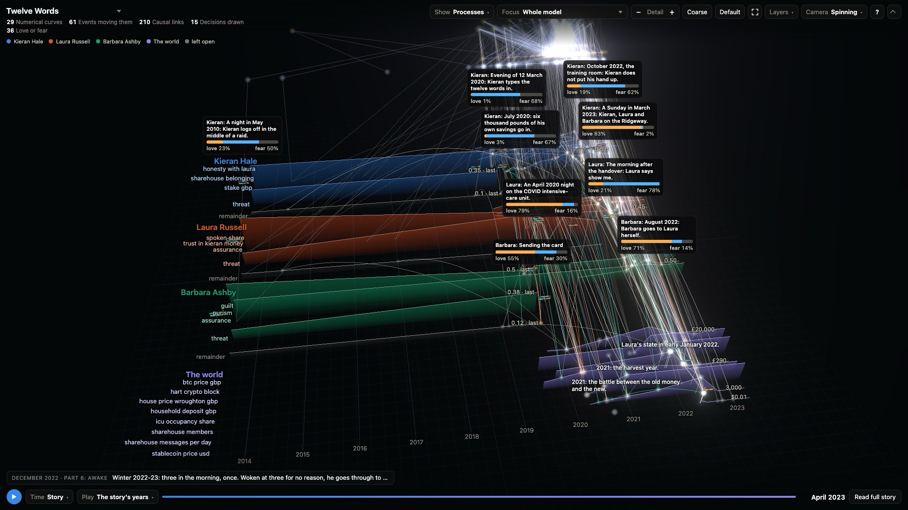
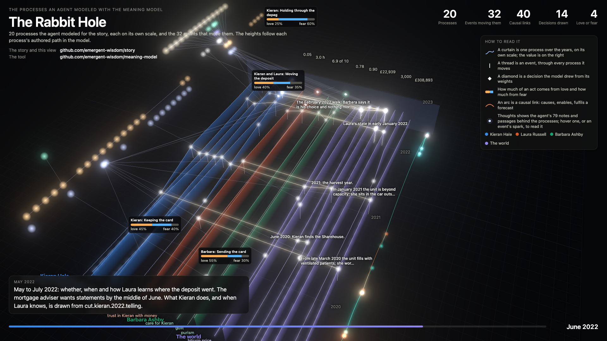

# Twelve Words and The Book of Conditions

Two stories built with the [Meaning Model](https://github.com/emergent-wisdom/meaning-model), with their worlds, character processes, physical settings and authored understanding available in one shared viewer.

**[Explore both stories in the interactive viewer](https://meaningmodel.ai/meaning-model/twelve-words/?reading=off&view=together&everything=&timeView=together)** — opens in your browser without installation. Use **Model** to switch between the books and their fictional authors' lives.

**Current editions:**

- **[Twelve Words](stories/twelve-words.md)** (October 6, 2026) — the continuing version of the novel first written live at the Stockholm Claude Community event on September 25.
- **[The Book of Conditions](stories/the-book-of-conditions.md)** (prose of October 2, model of October 6, 2026) — an alternative history of Babbage, Lovelace and a bounded calculating undertaking.

Since October 7, both stories are published with their complete construction histories, from the first revision to the current edition. The history before the September 29 public root is published for the first time, with private material removed; the full-history records for [Twelve Words](public/publication/twelve-words-full-history-2026-10-07.json) and [The Book of Conditions](public/publication/the-book-of-conditions-full-history-2026-10-07.json) list every replaced field and why. The editions themselves are unchanged.

The current *Book of Conditions* was created by Codex and Claude under Henrik Westerberg's direction.

[](media/twelve-words-processes.mp4)

**[Watch the viewer (64-second video)](media/twelve-words-processes.mp4).** Recorded with the October 2 Twelve Words edition: its processes over the story's years, the construction replayed step by step, the Tree, the full story beside its model, Space and Graph. The recording is silent.

These Markdown files are exact renders of the current public story graphs. The viewer's **Read full story** opens the same complete manuscript. The **Model** menu also opens the modeled lives of the fictional authors, Faye Titcombe and Nora Vale.

These examples are separate downloads. Installing Meaning Model MCP or the standalone viewer does **not** download either story. This repository and its release assets provide the optional models.

## Download a story model

- [Download The Book of Conditions](https://github.com/emergent-wisdom/story/raw/refs/heads/main/models/the-book-of-conditions.meaning-model.json.gz) (6.7 MB; 78 MiB unpacked)
- [Download Twelve Words](https://github.com/emergent-wisdom/story/raw/refs/heads/main/models/twelve-words.meaning-model.json.gz) (22 MB; 237 MiB unpacked)

Save the file on your computer and unpack it: double-click it, or run `gunzip twelve-words.meaning-model.json.gz`. The downloads are gzip-compressed because the complete Twelve Words history is larger than GitHub's file limit. With [Meaning Model MCP installed in your AI app](https://github.com/emergent-wisdom/meaning-model#readme), tell the assistant:

> Import the Meaning Model story file I downloaded, then open its latest graph in the viewer.

Give it the unpacked JSON file's location. The assistant uses `life_construction_import` with that absolute file path, then `life_model_viewer_open` with the returned `headGraphHash`. The Book uses the access scope `book.07r2.authoring`; Twelve Words uses `story-author`. Each download includes its fictional author's modeled life. The viewer makes that life available alongside the story. Import both files and ask **“Open these stories together”** to switch between them. You can continue writing from either imported edition.

These are native MCP construction bundles; no code, extraction step or source checkout is needed. They contain the current published world, prose and attributed understanding, including story reviews, and the complete construction history. Twelve Words has 462 graph revisions and 232 stored model definitions (229 of the story world and three of Faye Titcombe's life); The Book of Conditions has 334 graph revisions and 48 model definitions (45 of the Book and three of Nora Vale's life). Each history begins at the first revision of its construction. The part before the September 29 public root is a privacy projection of the original Writer history; the lineage published since then follows it unchanged in content, with new revision numbers and hashes. The full-history records map every former public hash to its counterpart. Exact checksums are the `fileSha256` (download) and `unpackedSha256` (unpacked JSON) values in the [publication manifest](public/PUBLICATION-MANIFEST.json).

## Open the viewer

Use the [interactive viewer on meaningmodel.ai](https://meaningmodel.ai/meaning-model/twelve-words/?reading=off&view=together&everything=&timeView=together), or run the same viewer locally:

```sh
git clone https://github.com/emergent-wisdom/story && cd story
npm install
npm run serve
```

Requires Node.js 22.18 or later. The install pins the [Meaning Model MCP 0.8.0 package from its GitHub release](https://github.com/emergent-wisdom/meaning-model/releases/tag/v0.8.0), and the shared launcher uses that same package. Open the local URL printed by the command. The reviewed snapshots load immediately; no engine installation is needed just to explore them.

**Show it as** switches between Processes (together or layers), Tree, Terrain, Graph, Structure and Space in one page. **Coarse view** gives the overview; more detail reveals subprocesses. Select a record to inspect its meaning and links. Use **Recenter** or Home to restore the overview. Physical positions come from declared coordinates and reference frames; the other graph layouts are not geography. To replay the construction from its first revision, choose **Play ▾ → The construction**. The books use ordered steps because their exports have no tool-call timestamps; the completed model remains available in Story time.

This repository uses the [shared viewer launcher 0.6.1](https://github.com/emergent-wisdom/meaning-model-viewer/releases/tag/v0.6.1) and the exact interface bundled with **Meaning Model MCP 0.8.0**, the same interface as the website. Existing `/processes.html` and `/landscape.html` event links open the current Twelve Words edition in their corresponding representation. An explicit current dataset choice remains selected. There is no separate story-specific viewer to maintain.

For your own models, install Meaning Model MCP in your AI app and ask **“Open this model.”** The assistant returns a local snapshot link. Ask **“Open these models together”** to compare selected models. When writing, ask **“Keep the viewer following as we work.”** The assistant opens the story's `graphHash` with `mode: "live"`; saved graph revisions update the model and prose at the same local URL. Updates preserve your reading context through guarded page refreshes and pause while you interact or play. A fork or inaccessible revision pauses following. Exact snapshot links remain available. No separate viewer checkout is required for normal MCP use. The hosted website shows the reviewed published editions and does not follow private drafts.

## What is published

[`models/`](models/) holds the two importable MCP downloads. [`public/models/`](public/models/) holds matching viewer snapshots for the stories and their fictional authors. The [publication manifest](public/PUBLICATION-MANIFEST.json) identifies the exact graph and model revisions, manuscript checksums and downloadable file checksums. [`public/publication/`](public/publication/) holds the October 7 full-history records and the earlier publication records. The models are the same in the downloads, manuscripts and viewer.

The public models retain authored thoughts, critical story reviews, revision findings, process values, spatial declarations and passage-to-Event links, together with their complete construction histories. Working databases, relay transcripts and private working files are not included. The October 2 Book copy replaces one local artifact path with its filename and discloses the mapping of affected graph revisions; its native definitions and manuscript match the reviewed continuation. Twelve Words corrects an unsupported subtype relation and explicitly marks selected numerical readings as unrenewed or unvalidated; their values are unchanged. These notes are review status, not an engine quarantine or a claim of a complete numerical reassessment. The [Book publication mapping](public/publication/book-publication-exploration-manifest-2026-10-02.json) and [Twelve Words repair manifest](public/publication/twelve-words-repair-manifest.json) record the exact scope.

The October 3 [Book privacy projection](public/publication/book-publication-privacy-2026-10-03.json) and [Twelve Words privacy projection](public/publication/twelve-publication-privacy-2026-10-03.json) remove private delegation and coordination from non-rendered notes throughout the selected histories. They retain the native definitions, substantive literary findings, and exact manuscripts, and map affected revisions to their public counterparts. Historical review hashes still identify their original evidence; this cleanup does not renew an approval or a numerical assessment.

The October 7 full-history records describe how each earlier history was projected: the September 29 replacements apply wherever the same original field occurs, and each further replacement is listed with its reason; original values and their hashes are not published. Hashes recorded inside historical notes and reviews keep their original meaning, and the records map each former public hash to its counterpart.

The Book manuscript is unchanged from the reviewed exploration output. The Twelve Words manuscript carries four edits made on October 6, 2026, when the world beneath the story was built from 2013; nineteen of its telling phases are marked as needing review since. This publication does not claim a new literary evaluation or alter the private Writer databases. Historical reviewer identities and reviewed-material hashes continue to name the original material, not a new certification of publication hashes. Twelve Words also includes the audited initial author-life model because historical story records explicitly refer to it.

## Original September 25 event archive

The original *Twelve Words* run was made for the Stockholm Claude Community event **Push the limits with Fable 5.1 n Opus 5.5**, September 25, 2026. A participant at the event described what they wanted the story to be about and supplied the prompt: a comfortable “blue pill” world, the white rabbit, and Paleolithic emotions, medieval institutions and godlike technology. **Claude Opus 5.5 Max** then wrote the novel autonomously, live at the event, using Meaning Model [v0.3.0](https://github.com/emergent-wisdom/meaning-model/releases/tag/v0.3.0).

The original event [text](runs/rabbit-hole/novel/novel.md) and [book PDF](pdf/rabbit-hole.pdf) remain unchanged. They differ from the current editions linked above. The [`runs/rabbit-hole/`](runs/rabbit-hole/) archive retains the event's brief, protocol, model-building scripts and selected inputs/results. Its raw database, relay transcript and copies containing quoted human coordination are no longer distributed. Exact raw operational replay is therefore unavailable from this checkout. See the [archive's publication note](runs/rabbit-hole/PROTOCOL.md#this-copy).

[](media/the-rabbit-hole-processes.mp4)

**[Watch the original interface (51-second video)](media/the-rabbit-hole-processes.mp4).** A later interface is recorded at the top of this page.

To inspect or continue Twelve Words in today's shared interface, use the current [model download](models/twelve-words.meaning-model.json.gz) or run `npm run serve`. Its history is the continuing version's own construction, from its first revision; it does not contain the original event's graph, database or call history.

## Work with a saved run

```sh
npx meaning-model-mcp --install-engine
npm run extract -- --run /path/to/your/private-run --out .local-work/run.json
npm run serve -- --data .local-work
```

Generated exports include the author's model, notes and construction record. Keep them in the ignored `.local-work/` directory until reviewed for publication. A story's authored understanding and critical reviews can remain part of its public model; private conversations, personal information and secrets must be removed deliberately.

`node sync-run.mjs /path/to/your/private-run <name>` stages a copy under `.local-work/imported-runs/<name>/`, including its database and call log. It requires that destination to be ignored and refuses an existing copy. It does not publish a run or certify its contents for publication.

For an agent actively working in a saved run, `npm run serve -- --run <folder> --live` checks the run once a minute and follows revisions in every representation. It waits for playback to pause before reloading the current view. Ordinary MCP links remain immutable snapshots unless the assistant opens a story graph with `mode: "live"`.

Existing Writer contributors can use `npm run view:writer` with their already running Writer relay. `MEANING_MODEL_RELAY` may name that relay's `relay.mjs`; the default is this checkout's ignored `work/relay.mjs`. This adapter discovers the latest unambiguous saved story and asks the existing MCP (0.5.1 or later) to open it in live mode. The same link follows later saved revisions. It starts no second database writer and is not needed to view the public snapshots.

For the current stories, use the downloads above. The original event graph was `6e840daa393fbdd16608dff4c81c045dca622386be4e9f8d5d7c95816d45eb29`, with scope `story-author`. This identifies the historical record; it is not an importable graph supplied by this checkout. Use the publication manifest to identify the later current public editions.

## Meaning Model

- [Project website and getting started](https://meaningmodel.ai/)
- [Source, releases and documentation](https://github.com/emergent-wisdom/meaning-model)
- [MCP package on npm](https://www.npmjs.com/package/@emergent-wisdom/meaning-model-mcp)
- [Paper: The Meaning Model](https://doi.org/10.5281/zenodo.22313515)
- [Emergent Wisdom](https://emergentwisdom.org)

The code is MIT; see [LICENSE](LICENSE). Third-party viewer notices ship with the MCP package.
